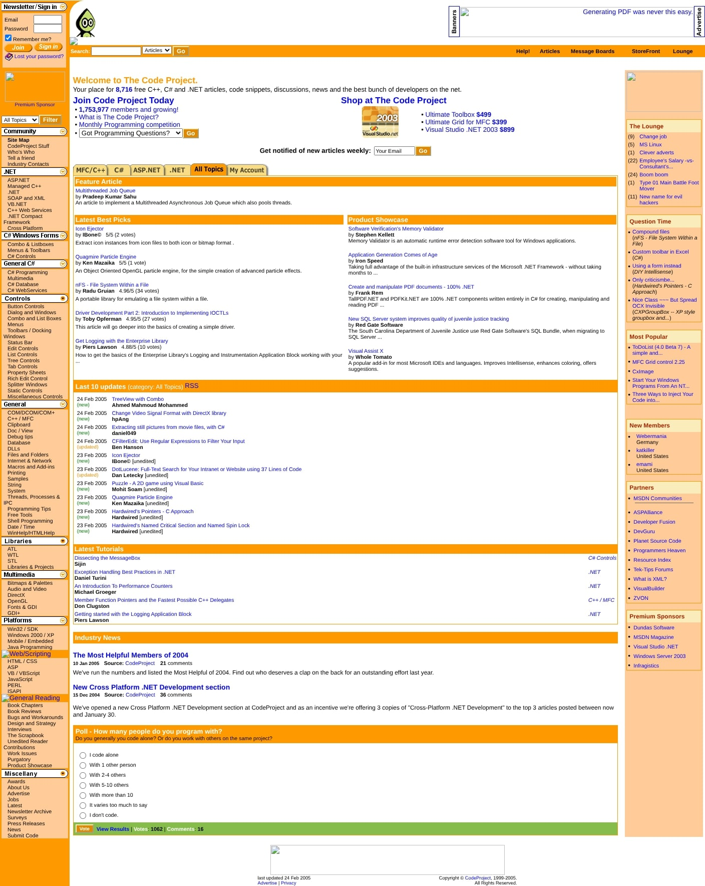
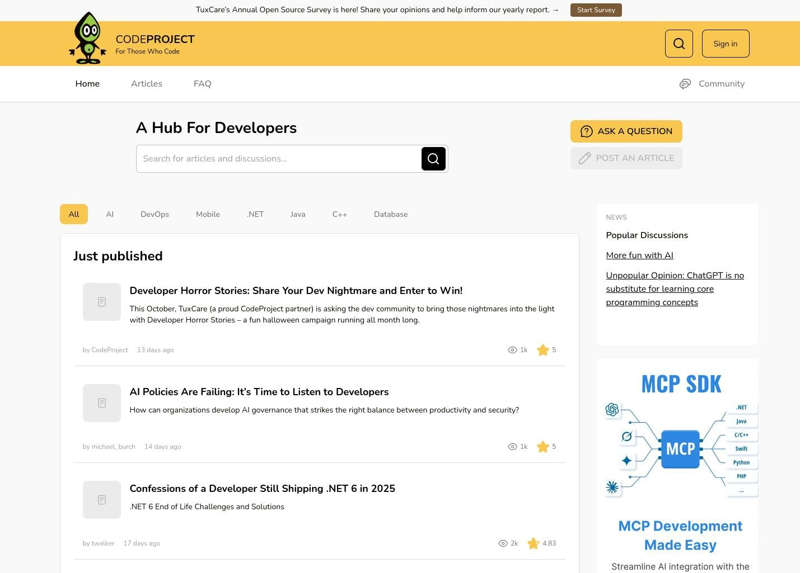
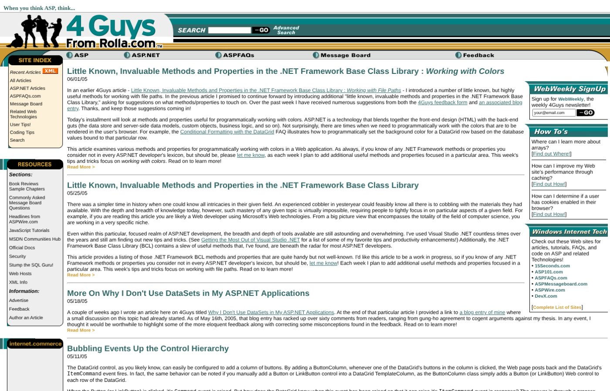
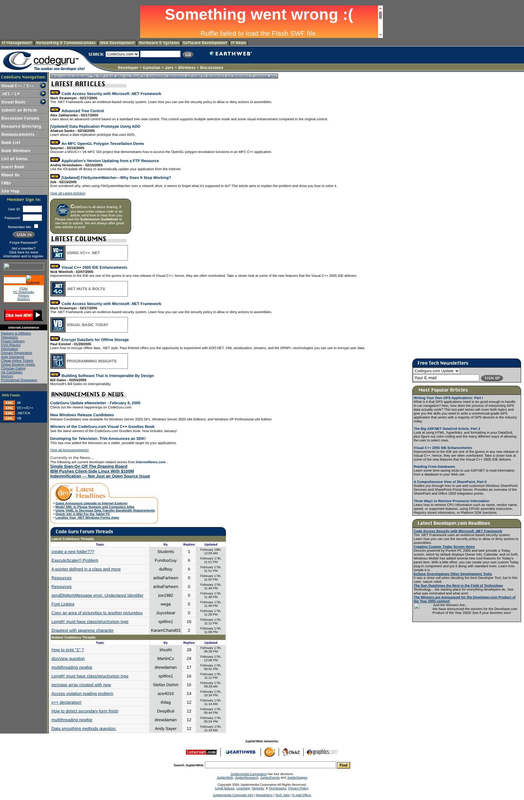
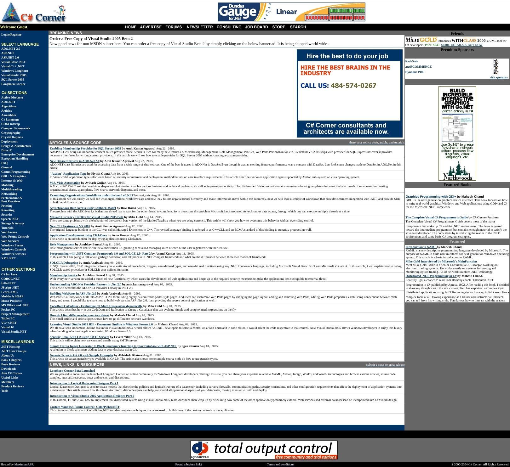

For the last few years, I've really started to notice that I'm getting old.  I don't mean that my knees are starting to ache or anything like that, but more and more I'm interacting with people where the age gap between us is enough that I'll mention an actor, TV show or website and just get a blank look back at me.  Then the realisation sets in that I'm talking about something from 15 years ago when they were probably 10 years old.  

As I approach 40, this is happening to me more and more.  It's also happening for young developers that I meet today as well.  Many of them have started their career sometime around the mid to late 2010's and so for them, websites like Stack Overflow and now ChatGPT are _their world_.  They have a hard knowledge cut off of anything before that, just like LLMs cannot tell you anything about the last 6 months.  This was also true for me when I started in the mid 2000's.  As an example, I've heard of [Usenet](https://en.wikipedia.org/wiki/Usenet) and I vaguely know what it is, but I've never used it or seen what it looks like.

So in this post, I want to remember and celebrate some of the websites that I used to frequent around 2005 - 2012 when I was at university and starting out in my career.  Websites that pre-date Stack Overflow and AI tools.  Websites that anyone who has a knowledge cut off of 2010 might not have ever heard of.  Websites that were actually pretty big deals in the community, or at least in the .NET community, which is what I was part of in the first part of my career.

All these websites are still online, but the original sites have long gone and what remains are just immitations occupying once loved domains.  Thankfully though, due to the glory of The Wayback Machine, we can still visit them.

## The Code Project

- Domain: www.codeproject.com 
- Active: 2005 - 2024
- Hayday: Mid 2005 - 2010

Let's begin with probably the most influential source of online learning for me during my early years.  The Code Project was a developer community with articles and tutorials on a wide variety of subjects.  It was the kind of website you just went to when you wanted some coding related juice.  These days, I go to Hacker News or Reddit for this, but honestly The Code Project was better.  New articles and tutorials were added multiple times per day.  It covered .NET, C++ and Windows development, web development and to a lesser extend other languages such as Perl.

I really hit my stride with programming during my University placement during which I worked a lot with C# and Windows Forms.  I spent a lot of hours following tutorials written by the community on The Code Project covering custom controls, background threads, GDI+ and drawing custom graphics to the screen.  Here is a random example on archive.org of a tutorial I might have followed: [.NET's ThreadPool Class - Behind The Scenes](http://web.archive.org/web/20050207001423/http://www.codeproject.com/csharp/threadtests.asp)

This website was just pure programming fun.  The design was bright and friendly.  The home page was bursting with new articles, forum posts, featured items - it all gave a real sense of a thriving and buzzing community.

If you visit www.codeproject.com today, there is a website there, the alien logo is there, but it's a shell of it's former self.  From doing a bit of research it seems the original site was in decline for a while and finally went offline sometime around 2023-24 before being resurrected by a new owner.  It remains to be seen whether it can be brought back to it's former glory, though I am not optimistic.  At the time of writing, the home page has articles that were published 13, 14 and 17 days ago marked as Just Published.  Compare that to 24th Feburary 2005 when 10 articles where published in two days.

Around 2013 I got a job that didn't require me to use .NET as much, so I stopped visiting The Code Project as often.  But whenever I did I'd get that warm feeling of visiting a place you used to spend a lot of time in.  It was always a cheer to see people still writing about anything and everything about .NET, Windows and the like.  

It really was a special place on the internet, and I'm grateful to all the contributors for the many hours of learning I got out of it.

## 4 Guys From Rolla

- Domain: www.4guysfromrolla.com 
- Active: 2005 - 2024
- Hayday: Mid 2005 - 2010

Next up, 4 Guys From Rolla.  Started in 1998, by four college friends (I guess from [Rolla](https://en.wikipedia.org/wiki/Rolla,_Missouri)), the strapline for this website was "When you think ASP, think... 4 Guys From Rolla".  Obviously, it was heavily ASP and ASP.NET focused.  Since I worked a lot with ASP.NET earler in my career, I spent a lot of time here.  The story is similar to The Code Project.  It had a dense and wide open design giving off the impression of activity and life as soon as you open the home page.  The articles were in-depth, interesting and well written.  There was also a message board and community that I didn't really engage with, but I believe were popular and active.  You could go there and know you were going to find something interesting to read.

In particular, I always liked the personal touch they had with their logo of the 4 guys.  On every visit, I would pause and wonder what the 1st guy is doing on the floor, appearing to be rocking back and forth while his three collegues lark around.  I assume it's some kind of in joke from the original writers, and I like that kind of thing.  

The site today is well and truely dead.  Again, if you go to the domain there is a website there, but I have no idea what it is or why it exists.  The articles are AI slop about about cars, crypto and online gambling.  The _Contact Us_ button links to 4guys@freeemail.biz and the Twitter and YouTube links go to some dead looking service called ENEWS.gg.  

I hope the original 4 Guys are doing well, they created something special and I'm grateful for the time they put into it.

## CodeGuru.com

- Domain: www.codeguru.com 
- Active: 2005 - 2024

The number one developer site!  I mean, it's what the strapline says, but really the #1 was The Code Project.  Regardless, I used to end up on CodeGuru.com pretty often.  Again, very .NET / Windows focused, with lots of articles and tutorials about all areas of development across the .NET platform.  It's a pretty drab looking site honestly, but something I like about it (and others from around this time) is the left navigation.  Even in 2005, some of the articles were 2-3 years old, but they still featured on the index pages you could get to from the left menu.  In the screenshot below you can see .NET / C# as a menu item, under which there is a whole menu system of subjects from Date & Time through to Web Services.  These are all index pages of articles from different time periods that are related to the relative subjects.  It makes it very easy to _browse_, like you would through a magazine.

Today, CodeGuru.com is still online.  The site has a new modern look which, in my opinion, is actually worse to use.  The left navigation I mentioned has been replaced with a strip of drop downs menu items.  When you open one of the menu items, the sub-categories are gone and everything is just lumped under "C#". If you look at the C# articles, it's a tile based layout of image heavy blog articles that just sucks to browse.  Look at the difference in browsability of the old (left) vs new (right):

Yeah, no thanks. 

## C-Sharp Corner

- Domain: www.c-sharpcorner.com 
- Active: 2005 - 2024
- Hayday: Mid 2005 - 2010

C-SharpCorner.com, from an era when hyphens in a domain name wouldn't get you instantly fired.  I don't recall really visiting it as a primary browsing destination, but it's lodged in my brain enough that I must have been on there fairly often.  I feel like it probably ranked well on Google and I'd end up there via a search result on some topic or another.

Looking at the site today, it looks so similar to CodeGuru.com I almost merged them together.  However, I liked CodeGuru.com more, so wanted to give it it's own bit.  To be fair though, C-SharpCorner.com has that sweet left navigation filled full of subject based index pages.  

Compared to what it looks like today, which is like some kind of StackOverflow groupie trying to dress like it's idol but looking very confused and awkward.  I haven't got a screenshot of it, but you can go and see for yourself.

Again, as with all these sites, the feeling from the 2025 version is that it's either dying, dead or ressurected as a Frankenstein monster of its old self.  Looking at the artcles, they are almost all written by the same handful of people.  These sites back in the day were a hive of user contributed material from across the developer community.

## SQL Authority

- Domain: blog.sqlauthority.com
- Active: 1970 - Present

So this is a funny one — blog.sqlauthority.com is an SQL Server focused blog run by a man named Pinal Dave.  I was never into SQL Server enought to visit this site as a primary browsing destination, but if you had a problem with SQL Server and you Googled it, there was at least a 50% chance you'd end up on here.

Pinal has been writing this site for as long as I can remember, and it looks like he is still writing new content for it regularly.  What is kinda awesome is that it looks _exactly_ the same as I remember it back in the 00s.  Almost brings a tear to my eye.

The pager at the bottom of the index page currently says 1 of 828 pages.  Assuming it's been running 20 years, that's 5796 articles (at 7 per page), which is 290 articles per year.  Which is almost an article every day.  For 20 years.  Damn.

Interestingly, you can't view blog.sqlauthority.com on Wayback Machine as it's been "excluded", so you'll just have to take my word for it that it always looked this way.

## Daily WTF

- Domain: thedailywtf.com
- Active: 2004 - Present

In case you don't know it, The Daily WTF is a daily blog chronicling amusing mishaps from the software world.  I was recommended it by a friend while I was in my internship in Germany back in 2007.  I made reading it part of my daily morning routine for that entire year.  I stopped visiting while at university but resumed for a while after.  It's pretty cool to see that it's still actively updated, even if the original team behind it has moved on, I really should go back there more often. The stories are short and easy to digest.  It's the perfect accompanyment to your morning coffee.

## Experts Exchange

- Domain: experts-exchange.com
- Active: 1996 - Present

What was that I was saying about hyphens?  Well, in this domain the hypen is doing a LOT of work.  ExpertSexchange, as people used to call it back then, is a really interesting story.  It started in the mid 1990s as a question and answer site similar to StackOverflow (but over 10 years earlier).  Growing from a student project, it became a popular website providing free services until 2004 when it shifted to a subscription based model.  This sounds normal today but at the time was very new.

Google would rank the results from experts-exchange.com pretty high, so for a lot of code or IT related questions you'd usually see a result from this site.  If you visited the site as a non-paying user, you'd be hit with a paywall asking you to upgrade, after you'd been teased with the question and part of an answer.  What wasn't well known at the time, including to me, was that in order to get the answer content indexed, you could just scroll down past the paywall and the content would be available at the bottom of the page.  The page was made to be very long and deliberately difficult to follow so that if you did know this trick you still had to suffer for it.

Essentially, experts-exchange.com was one of the pioneers of the StackOverflow Q&A models, and the paywall based subscription models used by modern day news outlets.  They also pioneered the dark UX used to tick these pages to show up in Google.  All back in 2004 which is pretty wild.

Obviously, I did not like this website, and many in the community were pretty unhappy when it flipped to being a subscription site.  I have no idea if it worked out for them... the site is still online today and still paid, but why anyone would subscribe in 2025 is lost on me.

## 2008: The Year Everything Changed

I don't know the point that all these websites started to decline, but I would imagine that it was sometime around 2008 with the launch of two major entites that would go on to become huge influences on the developer world: Github.com and StackOverflow.com.

While very different, these websites together ate the lunch of what a lot of sites like The Code Project provided; source code and tutorials / learning material.  StackOverflow became the defacto place you'd end up when you had any kind of problem.  While Github became the defacto home of code on the internet.  Prior to that, articles on The Code Project and other sites would include a .zip file at the end with the code examples in.

For me, the sad reality is that we have lost something with the decline of these sites that has not been replaced by the new generation; a place to just go when you want to browse.

StackOverflow is obviously having it's own issues now, and has seen a noticable drop in goodwill from the community from overbearing rules and policies on question quality.  But even before that, I would not visit StackOverflow to _read about stuff_, I would go there because I had a problem.   Similar with Github, I would not go there to _read about stuff_, I would go there for the code.

When I used to browse The Code Project, it was like picking up a magazine and just flicking through.  There was just stuff there, it was code related, it was interesting, you could learn from it, you could just dip in and out.  You could be certain on each visit that you were going to find something interesting to read and learn something you didn't know.  There was no politics, no business, no economics, just geeks writing about geek stuff.

Where do I go for that now?  Reddit?  Hackernews?  

Dev.to is maybe the closest thing I can think of that is alive today, but I can't really get into it and I'm not sure why.  Maybe it's the modern presentation which is very "5 reasons why you want to click this" focused.  Maybe it's something else.

Writing this piece has been bittersweet for me.  It was genuinely warming to see that garish orange of The Code Project once again and briefly browse it's pages.  The thing is, looking at something on archive.org is like watching a video of a passed love one.  You can see them, and hear them, but you can't talk to them, and they aren't really there.  It's just a glimpse.

Still, what an amazing resource we have with the Wayback Machine.  Even if it isn't _the same_, it's amazing to be able to go and see something you remember like it once was.  So thank you to the amazing people that make that resource available, and if you haven't before, [please consider donating](https://archive.org/donate?origin=iawww-TopNavDonateButton).

If you got this far,  thanks for reading.  
Steve